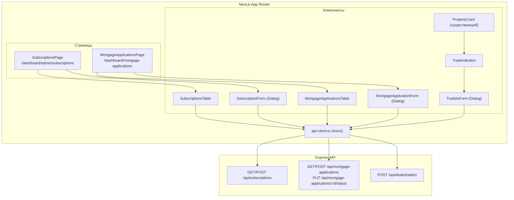
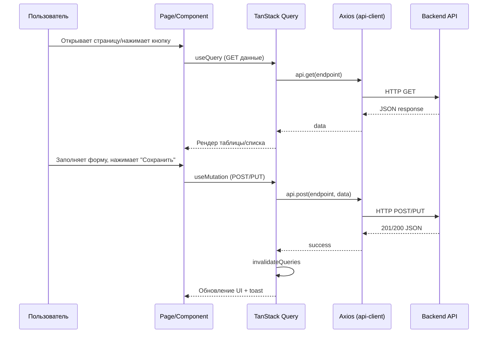

# Дизайн-документ: UI для трёх бизнес-фич Pro Casa

## Обзор

Данный документ описывает техническое решение для реализации трёх UI-фич платформы Pro Casa:

1. **Страница подписок** — админ-панель управления подписками пользователей (`/dashboard/admin/subscriptions`)
2. **Заявки в банки** — страница и форма подачи ипотечных заявок (`/dashboard/mortgage-applications`)
3. **TradeIn** — кнопка и форма обмена квартиры в карточке объекта CRM

Все три фичи используют существующий бэкенд API (Express + Prisma). Фронтенд строится на Next.js App Router, shadcn/ui, TanStack Query и Axios.

### Ключевые решения

- Повторное использование существующих паттернов проекта: `useQuery`/`useMutation` для данных, `api` (Axios) для запросов, `toast` (sonner) для уведомлений
- Все формы реализуются как `Dialog` (shadcn/ui) — консистентно с `CreateSellerForm`, `CreatePropertyForm`, `CloseDealDialog`
- Навигация добавляется в `AppSidebar` через массив `menuItems` и `adminMenuItem`
- Валидация форм на клиенте через контролируемые состояния React (паттерн проекта — без react-hook-form)

---

## Архитектура

### Общая схема



### Поток данных

Все три фичи следуют единому паттерну:



---

## Компоненты и интерфейсы

### Фича 1: Страница подписок (Админ)

#### Файловая структура

```
pro-casa/app/dashboard/admin/subscriptions/page.tsx    — страница
pro-casa/components/admin/SubscriptionsTable.tsx        — таблица подписок
pro-casa/components/admin/SubscriptionForm.tsx          — диалог создания подписки
```

#### SubscriptionsPage (`page.tsx`)

Серверный маршрут `/dashboard/admin/subscriptions`. Клиентский компонент (`"use client"`).

```typescript
// Состояние
const [isFormOpen, setIsFormOpen] = useState(false);

// Данные
const { data: subscriptions, isLoading } = useQuery({
  queryKey: ["subscriptions"],
  queryFn: () => api.get("/subscriptions").then(r => r.data),
});
```

#### SubscriptionsTable

Принимает `subscriptions: Subscription[]`, рендерит `<Table>` (shadcn/ui) с колонками:
- Пользователь (имя + email)
- Роль
- План (Badge с цветом)
- Статус (Badge с цветом)
- Дата начала
- Дата окончания
- Сумма

Цвета бейджей плана:
| План | Цвет |
|------|-------|
| FREE | `bg-gray-100 text-gray-700` |
| BASIC | `bg-blue-100 text-blue-700` |
| PRO | `bg-yellow-100 text-yellow-700` |
| ENTERPRISE | `bg-green-100 text-green-700` |

Цвета бейджей статуса:
| Статус | Цвет |
|--------|-------|
| ACTIVE | `bg-green-100 text-green-700` |
| EXPIRED | `bg-red-100 text-red-700` |
| CANCELLED | `bg-gray-100 text-gray-700` |

#### SubscriptionForm (Dialog)

Поля формы:
- `userId` — Select с поиском пользователей (`GET /api/users`)
- `plan` — Select: FREE, BASIC, PRO, ENTERPRISE
- `expiresAt` — Input type="date"
- `amount` — Input type="number"

```typescript
interface SubscriptionFormData {
  userId: string;
  plan: "FREE" | "BASIC" | "PRO" | "ENTERPRISE";
  expiresAt: string;
  amount: number | null;
}
```

Мутация:
```typescript
const mutation = useMutation({
  mutationFn: (data: SubscriptionFormData) => api.post("/subscriptions", data),
  onSuccess: () => {
    queryClient.invalidateQueries({ queryKey: ["subscriptions"] });
    toast.success("Подписка назначена");
    onClose();
  },
  onError: (err) => toast.error(err.response?.data?.error || "Ошибка"),
});
```

#### Навигация

Добавить в `adminMenuItem.subItems` в `app-sidebar.tsx`:
```typescript
{ title: "Подписки", url: "/dashboard/admin/subscriptions", icon: CreditCard }
```

---

### Фича 2: Заявки в банки (Брокер)

#### Файловая структура

```
pro-casa/app/dashboard/mortgage-applications/page.tsx   — страница
pro-casa/components/mortgage/MortgageApplicationsTable.tsx — таблица заявок
pro-casa/components/mortgage/MortgageApplicationForm.tsx   — диалог создания заявки
pro-casa/components/mortgage/StatusChangeDialog.tsx        — диалог смены статуса
```

#### MortgageApplicationsPage (`page.tsx`)

Маршрут `/dashboard/mortgage-applications`. Клиентский компонент.

```typescript
const { data: applications, isLoading } = useQuery({
  queryKey: ["mortgage-applications"],
  queryFn: () => api.get("/mortgage-applications").then(r => r.data),
});
```

#### MortgageApplicationsTable

Колонки таблицы:
- Клиент (имя + телефон)
- Банк
- Программа
- Сумма кредита
- Срок (мес.)
- Ставка (%)
- Статус (Badge)
- Дата создания

Цвета бейджей статуса:
| Статус | Цвет |
|--------|-------|
| DRAFT | `bg-gray-100 text-gray-700` |
| SUBMITTED | `bg-blue-100 text-blue-700` |
| REVIEWING | `bg-yellow-100 text-yellow-700` |
| APPROVED | `bg-green-100 text-green-700` |
| REJECTED | `bg-red-100 text-red-700` |
| CANCELLED | `bg-gray-100 text-gray-700` |

По клику на строку — открывается `StatusChangeDialog`.

#### MortgageApplicationForm (Dialog)

Поля формы:
- `clientId` — Select с клиентами (`GET /api/clients`)
- `bankName` — Input text (обязательное)
- `programName` — Input text (опциональное)
- `loanAmount` — Input number (обязательное)
- `termMonths` — Input number (обязательное)
- `interestRate` — Input number (опциональное)

```typescript
interface MortgageApplicationFormData {
  clientId: string;
  bankName: string;
  programName?: string;
  loanAmount: number;
  termMonths: number;
  interestRate?: number;
}
```

Валидация (клиентская):
- `clientId` — обязательное
- `bankName` — обязательное, непустая строка
- `loanAmount` — обязательное, > 0
- `termMonths` — обязательное, целое число > 0

#### StatusChangeDialog

Диалог для изменения статуса заявки:
- Select со статусами: DRAFT, SUBMITTED, REVIEWING, APPROVED, REJECTED, CANCELLED
- Textarea для `responseNotes`
- Мутация: `PUT /api/mortgage-applications/:id/status`

#### Навигация

Добавить в `menuItems` в `app-sidebar.tsx`:
```typescript
{
  title: "Заявки в банки",
  icon: FileText,
  url: "/dashboard/mortgage-applications",
  roles: ["ADMIN", "BROKER", "REALTOR"],
}
```

Вставить после пункта «Ипотека» (индекс ~7 в массиве).

---

### Фича 3: TradeIn в карточке объекта CRM

#### Файловая структура

```
pro-casa/components/crm/TradeInButton.tsx    — кнопка TradeIn
pro-casa/components/crm/forms/TradeInForm.tsx — диалог формы TradeIn
```

#### TradeInButton

Компактная кнопка, встраиваемая в `PropertyCardBase` рядом с кнопками Eye и AI:

```typescript
interface TradeInButtonProps {
  property: CrmProperty;
}
```

Рендерит иконку `ArrowLeftRight` (lucide). По клику открывает `TradeInForm`.

#### TradeInForm (Dialog)

Поля формы:
- `projectId` — Select с проектами (`GET /api/projects`), с индикатором загрузки
- `newApartmentPrice` — Input number (обязательное)
- `commissionPercent` — Input number, по умолчанию `1.5`
- `clientId` — Select с клиентами (`GET /api/clients`), опциональное
- `notes` — Textarea, опциональное

Автоматически подставляемые поля (скрытые):
- `oldPropertyId` — `property.id`
- `sellerId` — `property.sellerId`

```typescript
interface TradeInFormData {
  sellerId: string;       // auto: property.sellerId
  projectId: string;
  oldPropertyId: string;  // auto: property.id
  newApartmentPrice: number;
  commissionPercent: number;
  clientId?: string;
  notes?: string;
}
```

Расчёт комиссии в реальном времени:
```typescript
const commission = (newApartmentPrice * commissionPercent) / 100;
const casaFee = commission * 0.2;
```

Отображается под полями формы как информационный блок.

Мутация:
```typescript
const mutation = useMutation({
  mutationFn: (data: TradeInFormData) => api.post("/deals/tradein", data),
  onSuccess: () => {
    toast.success("TradeIn сделка создана");
    onClose();
  },
  onError: (err) => toast.error(err.response?.data?.error || "Ошибка создания TradeIn"),
});
```

#### Интеграция в PropertyCard

В `PropertyCardBase` добавить `TradeInButton` в секцию действий (рядом с Eye и AI кнопками), внутри блока `<div className="flex gap-1 z-20">`.

---

## Модели данных

### Subscription (из Prisma)

```typescript
interface Subscription {
  id: string;
  userId: string;
  plan: "FREE" | "BASIC" | "PRO" | "ENTERPRISE";
  status: "ACTIVE" | "EXPIRED" | "CANCELLED";
  startsAt: string;    // ISO date
  expiresAt: string | null;
  amount: number | null;
  createdAt: string;
  updatedAt: string;
  user: {
    id: string;
    email: string;
    firstName: string;
    lastName: string;
    role: string;
  };
}
```

### MortgageApplication (из Prisma)

```typescript
interface MortgageApplication {
  id: string;
  clientId: string;
  bankName: string;
  programName: string | null;
  loanAmount: number;
  termMonths: number;
  interestRate: number | null;
  status: "DRAFT" | "SUBMITTED" | "REVIEWING" | "APPROVED" | "REJECTED" | "CANCELLED";
  responseDate: string | null;
  responseNotes: string | null;
  brokerId: string;
  createdAt: string;
  updatedAt: string;
  client: {
    id: string;
    firstName: string;
    lastName: string;
    phone: string;
  };
}
```

### TradeIn Deal (подмножество Deal)

```typescript
interface TradeInDeal {
  id: string;
  amount: number;          // newApartmentPrice
  commission: number;      // рассчитанная комиссия
  casaFee: number;         // 20% от комиссии
  isTradeIn: true;
  tradeInPropertyId: string | null;
  tradeInProjectId: string | null;
  tradeInCommission: number; // процент комиссии
  objectType: "PROPERTY";
  objectId: string | null;
  clientId: string | null;
  notes: string | null;
  brokerId: string;
  status: "IN_PROGRESS";
  createdAt: string;
}
```

### API контракты

| Эндпоинт | Метод | Тело запроса | Ответ |
|-----------|-------|-------------|-------|
| `/api/subscriptions` | GET | — | `Subscription[]` |
| `/api/subscriptions` | POST | `{ userId, plan, expiresAt?, amount? }` | `Subscription` |
| `/api/mortgage-applications` | GET | query: `clientId?`, `status?` | `MortgageApplication[]` |
| `/api/mortgage-applications` | POST | `{ clientId, bankName, programName?, loanAmount, termMonths, interestRate? }` | `MortgageApplication` |
| `/api/mortgage-applications/:id/status` | PUT | `{ status, responseNotes? }` | `MortgageApplication` |
| `/api/deals/tradein` | POST | `{ sellerId, projectId?, oldPropertyId?, newApartmentPrice, commissionPercent?, clientId?, notes? }` | `Deal` |
| `/api/users` | GET | — | `User[]` (для выбора в форме подписки) |
| `/api/clients` | GET | — | `Client[]` (для выбора в формах) |
| `/api/projects` | GET | — | `Project[]` (для выбора ЖК в TradeIn) |
