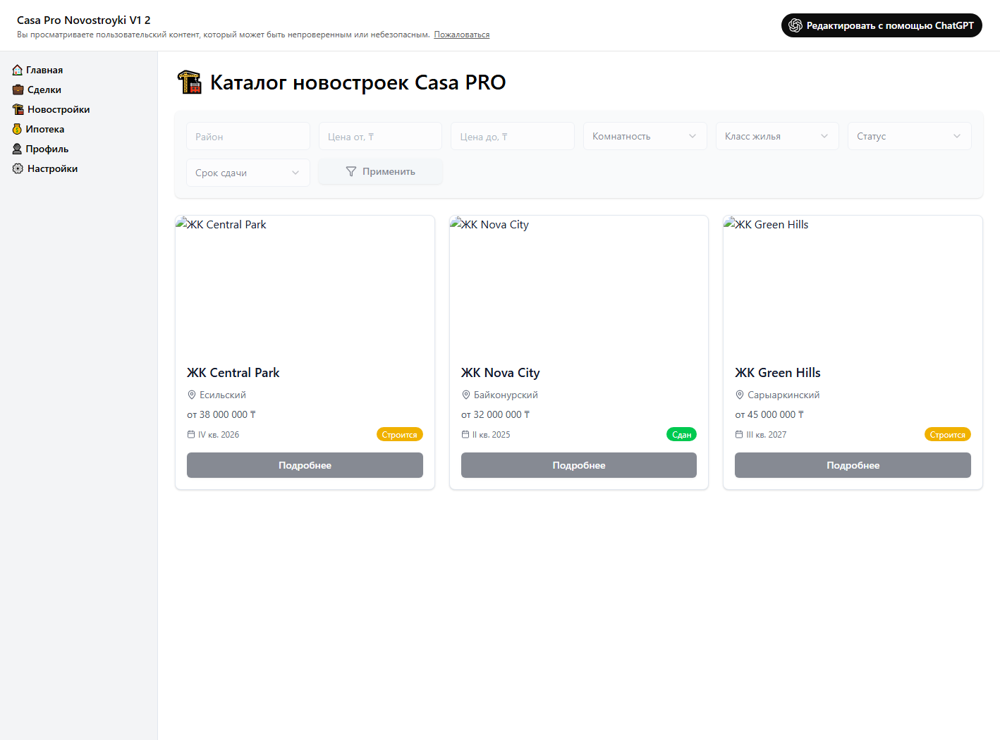

# UI Описание: Casa Pro Novostroyki V1 2
Источник: ChatGPT - Casa Pro Novostroyki V1 2.mhtml

📌 БОКОВАЯ ПАНЕЛЬ (sidebar)
────────────────────────────────────────
  🧭 Навигация:
    🔗 Ссылка [🏠 Главная]
    🔗 Ссылка [💼 Сделки]
    🔗 Ссылка [🏗️ Новостройки]
    🔗 Ссылка [💰 Ипотека]
    🔗 Ссылка [👤 Профиль]
    🔗 Ссылка [⚙️ Настройки]

📄 ОСНОВНОЙ КОНТЕНТ
────────────────────────────────────────

# 🏗️ Каталог новостроек Casa PRO

  🃏 Карточка:
    📝 Поле ввода [Район]
    📝 Поле ввода [Цена от, ₸]
    📝 Поле ввода [Цена до, ₸]
    🔘 Кнопка [Комнатность]
    🔘 Кнопка [Класс жилья]
    🔘 Кнопка [Статус]
    🔘 Кнопка [Срок сдачи]
    🔘 Кнопка [Применить]

  🃏 Карточка:
    🖼️ Изображение [ЖК Central Park]

### ЖК Central Park
    Есильский
    от 38 000 000 ₸
    🔘 Кнопка [Подробнее]

  🃏 Карточка:
    🖼️ Изображение [ЖК Nova City]

### ЖК Nova City
    IV кв. 2026 Строится Байконурский
    от 32 000 000 ₸
    🔘 Кнопка [Подробнее]

  🃏 Карточка:
    🖼️ Изображение [ЖК Green Hills]

### ЖК Green Hills
    II кв. 2025 Сдан Сарыаркинский
    от 45 000 000 ₸
    🔘 Кнопка [Подробнее]