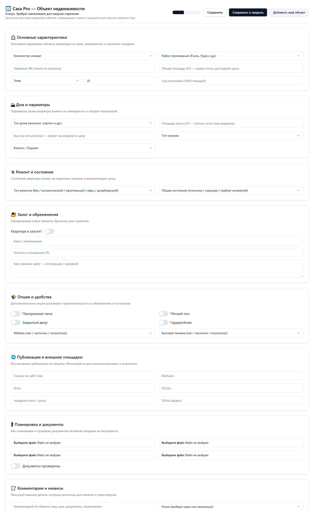

# UI Описание: Casa Pro Object Card
Источник: ChatGPT - Casa Pro Object Card_files.html

## 🏢 Casa Pro — Объект недвижимости
    Статус: Требует заполнения для запуска стратегии
    Заполните ключевые параметры объекта, информацию о залоге и документы для запуска стратегии Casa
    🔘 Кнопка [Сохранить]
    🔘 Кнопка [Сохранить и закрыть]
    🔘 Кнопка [Добавить ещё объект]

  🃏 Карточка:

### 🏠 Основные характеристики
    Ключевые параметры объекта, влияющие на цену, ликвидность и стратегию продажи.
    🔘 Кнопка [Количество комнат]
    🔘 Кнопка [Район проживания (Есиль, Нура и др.)]
    📝 Поле ввода [Название ЖК (поиск по каталогу)]
    📝 Поле ввода [Общая площадь (м²) — укажи точно для оценки цены]
    🔘 Кнопка [Этаж]
    📝 Поле ввода [Этажность ЖК]
    📝 Поле ввода [Год постройки (1950–текущий)]

  🃏 Карточка:

### 🏗 Дом и параметры
    Параметры дома напрямую влияют на ликвидность и портрет покупателя.
    🔘 Кнопка [Тип дома (монолит, кирпич и др.)]
    📝 Поле ввода [Площадь кухни (м²) — уточни, если зона выделена]
    📝 Поле ввода [Высота потолков (м) — влияет на комфорт и цену]
    🔘 Кнопка [Тип санузла]
    🔘 Кнопка [Балкон / Лоджия]

  🃏 Карточка:

### 🛠 Ремонт и состояние
    Состояние квартиры влияет на стратегию показов и аргументацию цены.
    🔘 Кнопка [Тип ремонта (без / косметический / капитальный / евро / дизайнерский)]
    🔘 Кнопка [Общее состояние (отличное / хорошее / требует вложений)]

  🃏 Карточка:

### 🔐 Залог и обременения
    Юридический статус объекта. Критично для стратегии.
    📝 Поле ввода [Банк / организация]
    📝 Поле ввода [Остаток к погашению (₸)]
    📝 Текстовое поле [Как снимаем залог — инструкция / сценарий]

  🃏 Карточка:

### ✨ Опции и удобства
    Квартира в залоге? Дополнительные опции усиливают привлекательность в объявлениях и на показах.
    🔘 Кнопка [Мебель (нет / частично / полностью)]
    🔘 Кнопка [Бытовая техника (нет / частично / полностью)]

  🃏 Карточка:

### 🌐 Публикации и внешние площадки
    Панорамные окна Тёплый пол Закрытый двор Гардеробная Все активные публикации по объекту. Используется для контроля рекламы и аналитики.
    📝 Поле ввода [Ссылка на сайт Casa]
    📝 Поле ввода [Krisha.kz]
    📝 Поле ввода [Kn.kz]
    📝 Поле ввода [OLX.kz]
    📝 Поле ввода [Instagram (пост / рилс)]
    📝 Поле ввода [TikTok (видео)]

  🃏 Карточка:

### 📎 Планировка и документы
    Без планировки и проверки документов активная продажа не запускается.
    📝 Поле ввода [Планировка]
    📝 Поле ввода [Техпаспорт]
    📝 Поле ввода [Правоустанавливающие документы]
    📝 Поле ввода [Доп. документы]

  🃏 Карточка:

### 📝 Комментарии и нюансы
    Документы проверены Фиксируй важные детали, которые критичны для показов и переговоров.
    📝 Текстовое поле [Комментарий по объекту: вид, шум, документы, ограничения]
    🔘 Кнопка [Риски (выбери одно или несколько)]
    📝 Поле ввода [Особые условия]