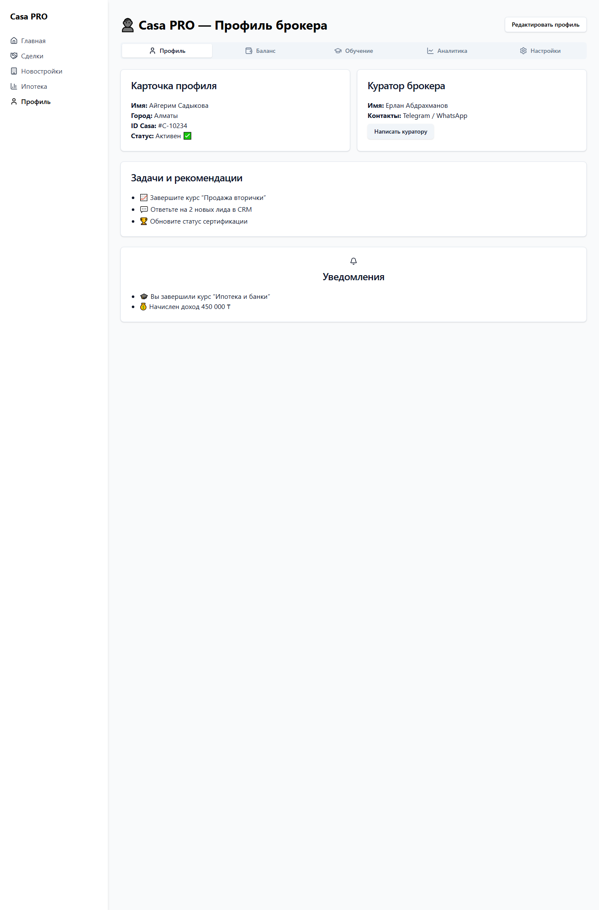

# UI Описание: Casa Pro Profile V1 2
Источник: ChatGPT - Casa Pro Profile V1 2_files.html

📌 БОКОВАЯ ПАНЕЛЬ (sidebar)
────────────────────────────────────────

## Casa PRO
  🧭 Навигация:
    🔗 Ссылка [Главная]
    🔗 Ссылка [Сделки]
    🔗 Ссылка [Новостройки]
    🔗 Ссылка [Ипотека]
    🔗 Ссылка [Профиль]

📄 ОСНОВНОЙ КОНТЕНТ
────────────────────────────────────────

# 👤 Casa PRO — Профиль брокера
    🔘 Кнопка [Редактировать профиль]

  🔀 ВКЛАДКИ:
    🔘 Кнопка [Профиль]
    🔘 Кнопка [Баланс]
    🔘 Кнопка [Обучение]
    🔘 Кнопка [Аналитика]
    🔘 Кнопка [Настройки]

  📑 Содержимое вкладки:

  📑 Содержимое вкладки:

  📑 Содержимое вкладки:

  📑 Содержимое вкладки:

  📑 Содержимое вкладки:

  🃏 Карточка:
    Настройки уведомлений Уведомления включены ✅
    🔘 Кнопка [Изменить настройки]

  🃏 Карточка:
    • Уведомления 🎓 Вы завершили курс “Ипотека и банки”
    • 💰 Начислен доход 450 000 ₸