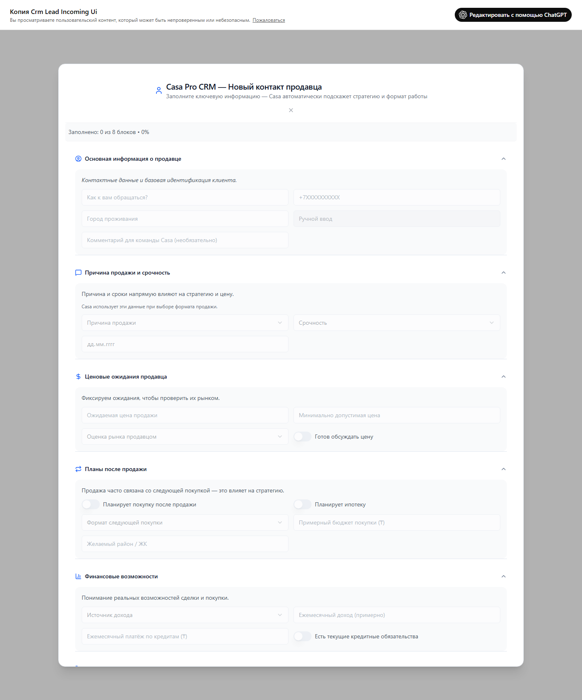

# UI Описание: Копия Crm Lead Incoming Ui
Источник: ChatGPT - Копия Crm Lead Incoming Ui.mhtml

🃏 Карточка:
    Casa Pro CRM — Новый контакт продавца Заполните ключевую информацию — Casa автоматически подскажет стратегию и формат работы
    Заполнено: 0 из 8 блоков • 0%

### Основная информация о продавце
    Контактные данные и базовая идентификация клиента.
    📝 Поле ввода [Как к вам обращаться?]
    📝 Поле ввода [+7XXXXXXXXXX]
    📝 Поле ввода [Город проживания]
    📝 Поле ввода [Ручной ввод]
    📝 Поле ввода [Комментарий для команды Casa (необязательно)]

### Причина продажи и срочность
    Причина и сроки напрямую влияют на стратегию и цену.
    Casa использует эти данные при выборе формата продажи.
    🔘 Кнопка [Причина продажи]
    🔘 Кнопка [Срочность]
    📝 Поле ввода [Планируемая дата продажи (если есть)]

### Ценовые ожидания продавца
    Фиксируем ожидания, чтобы проверить их рынком.
    📝 Поле ввода [Ожидаемая цена продажи]
    📝 Поле ввода [Минимально допустимая цена]
    🔘 Кнопка [Оценка рынка продавцом]

### Планы после продажи
    Готов обсуждать цену Продажа часто связана со следующей покупкой — это влияет на стратегию.
    🔘 Кнопка [Формат следующей покупки]
    📝 Поле ввода [Примерный бюджет покупки (₸)]
    📝 Поле ввода [Желаемый район / ЖК]

### Финансовые возможности
    Планирует покупку после продажи Планирует ипотеку Понимание реальных возможностей сделки и покупки.
    🔘 Кнопка [Источник дохода]
    📝 Поле ввода [Ежемесячный доход (примерно)]
    📝 Поле ввода [Ежемесячный платёж по кредитам (₸)]

### Коммуникация с клиентом
    Есть текущие кредитные обязательства Как удобнее и корректнее выстроить контакт.
    📝 Поле ввода [Формат обращения]
    🔘 Кнопка [Канал связи]
    🔘 Кнопка [Удобное время для связи]

### Объект продажи
    ⚠️ Без объекта стратегия не может быть определена. Добавьте хотя бы один объект для продолжения работы.
    🔘 Кнопка [Сохранить и добавить объект]
    Объект не добавлен — стратегия не определена

### Формат работы с Casa (обязательно)
    От этого решения зависит, запускаем ли мы активную продажу.
    🔘 Кнопка [Готовность к эксклюзиву]
    🔘 Кнопка [Следовать стратегии Casa]
    📝 Поле ввода [Доверие к компании (1–5)]
    🧠 Вывод Casa
    Эксклюзив: ❌ нет
    Следование стратегии: ⚠️ под вопросом
    Доверие: 3 / 5
    Рекомендация Casa: 🔴 Ограниченное вовлечение
    🔘 Кнопка [➕ Сохранить и добавить объект]
    🔘 Кнопка [Сохранить контакт]